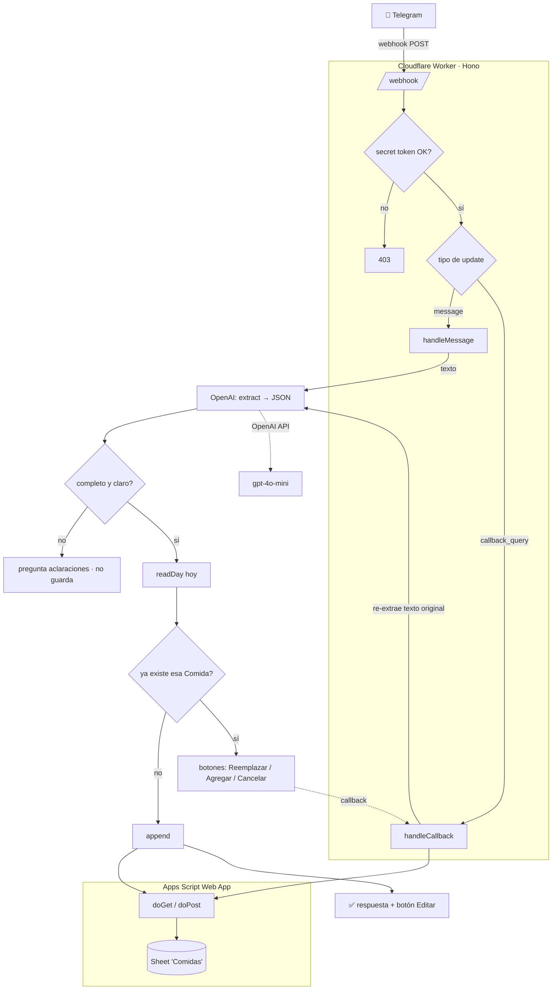

# meal-tracker

Bot de Telegram para registrar comidas en un Google Sheet desde el celular. Mandás un mensaje
("almorcé milanesa con ensalada en casa"), el bot lo estructura con OpenAI y escribe la fila en
la planilla. Stateless, uso personal (~10 mensajes/día), corre gratis en Cloudflare Workers.

## Arquitectura



### Componentes

| Pieza | Archivo | Rol |
|---|---|---|
| Worker / webhook | `src/index.ts` | Recibe updates de Telegram, orquesta el flujo, responde. |
| Extracción | `src/openai.ts` | `gpt-4o-mini` con structured outputs → `MealEntry`. |
| Cliente del sheet | `src/sheets.ts` | Llama al Apps Script (read/append/overwrite + views), con token. |
| Backend del sheet | `apps-script/Code.gs` | Web app que lee/escribe la planilla. Contrato en `apps-script/README.md`. |

## Flujo

1. **Mensaje de texto** → `extract()` saca `comida / modo / calificacion / notas`.
2. **No infiere**: si falta algo o el modo es Delivery/Afuera sin lugar, **pregunta** y no guarda.
3. **Read-before-write**: lee el día; si ya hay esa comida, ofrece **Reemplazar / Agregar / Cancelar**
   (la fila viaja en el `callback_data`, stateless).
4. **Guarda** → `append`, responde `✅ Guardado` con botón **✏️ Editar**.
5. **Editar**: tocás el botón → respondés con la corrección → `overwrite` de esa fila.

### Reglas de dominio

- **`calificacion`** (OK/Mid/Bad) = calidad **nutricional**, no cuánto gustó.
- **`Score`** (columna E) es **fórmula del sheet**: `SWITCH(Modo) + SWITCH(Calificacion)`, rango 0–5.
  El bot nunca lo setea; el Apps Script reescribe la fórmula por fila (con `;`, locale español).
- **`Notas`**: formato `{lugar|evento} - plato`. Casa = solo el plato; Delivery/Afuera = lugar + plato.
- **`Fecha`**: hoy en `America/Argentina/Buenos_Aires`, valor de fecha real.

### Garantías del backend (Apps Script)

- `append`/`overwrite` solo tocan filas **de hoy** (chequeo server-side con el reloj de BA).
- Acceso "Anyone" + **secret token** en cada request (la URL puede ser pública, el token no).
- Detalle completo del contrato: [`apps-script/README.md`](apps-script/README.md).

## Datos del sheet

Pestañas: **Comidas** (datos), Eventos, **View diario**, **View semanalmensual**.
Columnas de Comidas: `Fecha | Comida | Modo | Calificacion | Score | Notas`.
Las views (diario/semanal/mensual) se leen pero no se escriben.

## Deploy

```bash
npm install
npx wrangler deploy
```

### Secrets (Worker)

```bash
npx wrangler secret put TELEGRAM_BOT_TOKEN       # de @BotFather
npx wrangler secret put TELEGRAM_WEBHOOK_SECRET  # random; valida cada webhook
npx wrangler secret put OPENAI_API_KEY
npx wrangler secret put SHEETS_WEBAPP_URL        # URL /exec del Apps Script
npx wrangler secret put SHEETS_API_SECRET        # = Script Property API_SECRET
```

Registrar el webhook (una vez):

```bash
curl "https://api.telegram.org/bot<TOKEN>/setWebhook" \
  -H "content-type: application/json" \
  -d '{"url":"<WORKER_URL>/webhook","secret_token":"<WEBHOOK_SECRET>"}'
```

### Apps Script

Pegar `apps-script/Code.gs` en Extensions → Apps Script de la planilla, setear el Script Property
`API_SECRET`, y **Deploy → Web app** (Execute as: Me, Who has access: Anyone). Cada cambio de
código requiere **New version** sobre el mismo deployment para que tome.

## Desarrollo

```bash
npx tsc --noEmit     # typecheck
npx wrangler dev     # local (usa .dev.vars)
npx wrangler tail    # logs en vivo
```

Los mensajes del bot incluyen detalle técnico (modo dev): operación + fila ejecutada
(`append · fila 413`) y, ante un error, el stack crudo formateado.

## Pendientes / futuro

- Notas de voz (transcripción `gpt-4o-mini-transcribe`) — el código existe en `openai.ts`, falta
  cablear la descarga del audio en el webhook.
- Recap automático al cerrar semana/mes (Cron Trigger + `readSemanal`/`readMensual`).
