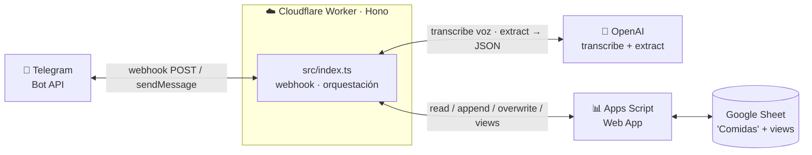

# meal-tracker

Bot de Telegram para registrar comidas en un Google Sheet desde el celular. Mandás un mensaje
de texto **o una nota de voz** ("almorcé milanesa con ensalada en casa"), el bot lo transcribe y
estructura con OpenAI y escribe la fila en la planilla. Stateless, uso personal (~10 mensajes/día),
corre gratis en Cloudflare Workers.

## Arquitectura



### Componentes

| Pieza | Archivo | Rol |
|---|---|---|
| Worker / webhook | `src/index.ts` | Recibe updates de Telegram, orquesta el flujo, responde. |
| Lógica pura | `src/logic.ts` | Tabla de contexto, validación de huecos, parse/format de mensajes y diff/summary, testeados en `test/logic.test.ts`. |
| Telegram | `src/telegram.ts` | Helpers de la Bot API (descarga de archivos para notas de voz). |
| Transcripción + extracción | `src/openai.ts` | `gpt-4o-mini-transcribe` (voz→texto) + `gpt-5.6-luna` structured outputs → `MealEntry`. |
| Cliente del sheet | `src/sheets.ts` | Llama al Apps Script (read/append/overwrite + views), con token. |
| Backend del sheet | `apps-script/Code.gs` | Web app que lee/escribe la planilla. Contrato en `apps-script/README.md`. |

## Flujo

1. **Mensaje de texto o nota de voz** → la voz se transcribe con `transcribe()`, después
   `extract()` saca `fecha / comida / modo / calificacion / notas` + una `accion`
   (`agregar` | `editar`). Ambos caminos comparten el pipeline.
2. **Datos obligatorios**: pregunta si falta modo o calificación. Lugar, plato y notas son opcionales:
   si no se mencionan, se omiten sin preguntar. Fecha y comida se resuelven con el mensaje y la
   secuencia; una ambigüedad que impida ubicar el registro o un hueco obligatorio bloquea la carga.
3. **Read-before-write**: lee el día y ubica la fila que tocaría (misma comida, o la fila exacta si
   el mensaje responde a un registro guardado). Si hay match —edición o colisión con una comida ya
   cargada— propone un **overwrite** con botones **✅ Aceptar / ✖️ Rechazar** (la fila viaja en el
   `callback_data` y la propuesta se re-parsea del texto al aceptar, todo stateless). No se agregan
   duplicados de la misma comida.
4. **Guarda** → una comida nueva sin colisión se hace `append` directo y responde `✅ Guardado`.
5. **Editar**: respondés (texto o voz) a un mensaje de comida guardada; ese registro se le pasa al
   modelo como contexto fuerte y, si decide `editar`, propone el `overwrite` de esa fila (paso 3).
6. **Cierres de ciclo**: la Cena es el último momento del día. Al guardar una Cena (`append` o
   `overwrite`), el bot manda el **recap del día** (`readDiario`); si esa fecha es domingo, también
   el **semanal** (`readSemanal`); si es el último día del mes, el **mensual** (`readMensual`).
   Event-driven, sin cron.

Cada respuesta incluye, en un bloque colapsable **🧩 Contexto del LLM**, el mensaje/transcript
original (`💬`/`🎤`) más una tabla de comidas cargadas, pendientes y meriendas omitidas, para debugging.
El lookback del contexto es de **7 días**: hoy y los seis días anteriores, según la fecha de
Buenos Aires, ordenados del más antiguo al más reciente.
No hay un hint separado. Merienda queda pendiente mientras no haya ningún registro posterior;
si lo hay, se considera omitida. Un hueco obligatorio desde el primer día con registros hasta
la última comida cargada produce un error. Se valida también la secuencia resultante antes de
agregar o proponer una edición, y nuevamente al aceptarla. Los días vacíos anteriores al primer
día con registros quedan fuera de la secuencia conocida.

### Reglas de dominio

- **`calificacion`** (OK/Mid/Bad) = calidad **nutricional**, no cuánto gustó.
- **`Score`** (columna E) es **fórmula del sheet**: `SWITCH(Modo) + SWITCH(Calificacion)`, rango 0–5.
  El bot nunca lo setea; el Apps Script reescribe la fórmula por fila (con `;`, locale español).
- **`Notas`**: opcionales. Formato `{lugar|evento} - plato` cuando están ambos; si solo hay uno,
  se guarda ese dato sin separador, y si no hay detalles se deja vacío.
- **`Fecha`**: entre 00:00 y 05:59, `"hoy"` significa el día calendario anterior (hasta dormir),
  salvo que el mensaje indique explícitamente que ya empezó el nuevo día. Sin fecha explícita,
  se sigue la secuencia del contexto. El usuario carga las comidas en orden
  `Desayuno → Almuerzo → Merienda → Cena`; el contexto reciente ayuda a conservar esa secuencia.
  **Merienda es la única comida opcional**; Desayuno, Almuerzo y Cena son obligatorias. Fechas
  explícitas como `"ayer"`, `"el lunes"` o `"12/06"` se resuelven aparte.
- **Carga atrasada**: el usuario puede ponerse al día cargando varias comidas juntas y en secuencia.
  La comida nombrada en el mensaje siempre gana sobre la hora. Si no nombra ninguna, se elige la
  pendiente más antigua (incluida Merienda mientras no haya una carga posterior), aunque el
  horario actual corresponda a una comida posterior. Una comida explícita siempre prevalece;
  si dejaría un hueco obligatorio, se informa el error en vez de reasignarla.

### Garantías del backend (Apps Script)

- `append`/`overwrite` solo tocan filas dentro de una **ventana reciente** (últimos 7 días, sin
  futuro), con chequeo server-side usando el reloj de BA. `append` exige `fecha` (sin default).
- Acceso "Anyone" + **secret token** en cada request (la URL puede ser pública, el token no).
- Detalle completo del contrato: [`apps-script/README.md`](apps-script/README.md).

### Candado por chat (Worker)

El webhook secret prueba que el POST viene de Telegram, pero no **quién** escribió. Para que solo
vos puedas escribir en el sheet, el Worker filtra por `ALLOWED_CHAT_ID`: cualquier chat distinto se
ignora respondiendo `200 ok` (no 403, para no darle pistas al de afuera ni gatillar reintentos). Si
queda vacío no se filtra (útil en dev).

## Datos del sheet

Pestañas: **Comidas** (datos), Eventos, **View diario**, **View semanalmensual**.
Columnas de Comidas: `Fecha | Comida | Modo | Calificacion | Score | Notas`.
Las views (diario/semanal/mensual) se leen pero no se escriben.

## Deploy

> Operación del día a día (deploy, logs, rotar secrets, redeploy del Apps Script,
> troubleshooting): ver [`OPERATIONS.md`](OPERATIONS.md).

```bash
npm install
npx wrangler deploy
```

### Secrets (Worker)

```bash
npx wrangler secret put TELEGRAM_BOT_TOKEN       # de @BotFather
npx wrangler secret put TELEGRAM_WEBHOOK_SECRET  # random; valida cada webhook
npx wrangler secret put OPENAI_API_KEY
npx wrangler secret put SHEETS_WEBAPP_URL        # URL /exec del Apps Script
npx wrangler secret put SHEETS_API_SECRET        # = Script Property API_SECRET
npx wrangler secret put ALLOWED_CHAT_ID          # tu chat id de Telegram (candá el bot a vos)
```

Registrar el webhook (una vez):

```bash
curl "https://api.telegram.org/bot<TOKEN>/setWebhook" \
  -H "content-type: application/json" \
  -d '{"url":"<WORKER_URL>/webhook","secret_token":"<WEBHOOK_SECRET>"}'
```

### Apps Script

Pegar `apps-script/Code.gs` en Extensions → Apps Script de la planilla, setear el Script Property
`API_SECRET`, y **Deploy → Web app** (Execute as: Me, Who has access: Anyone). Cada cambio de
código requiere **New version** sobre el mismo deployment para que tome.

## Desarrollo

```bash
npx tsc --noEmit     # typecheck
npx wrangler dev     # local (usa .dev.vars)
npx wrangler tail    # logs en vivo
```

Los mensajes del bot incluyen detalle técnico (modo dev): operación + fila ejecutada
(`append · fila 413`) y, ante un error, el stack crudo formateado.

## Pendientes / futuro

- (sin pendientes grandes por ahora)
